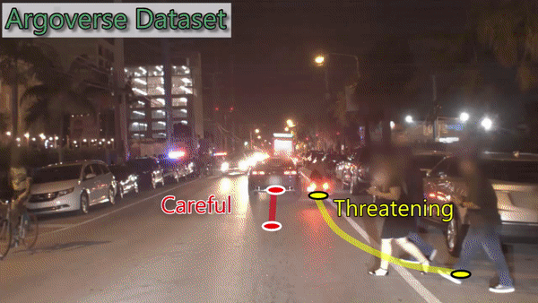

A traffic simulation software based on SUMO that incorporates driver behavior. Watch the following GIF for a demo:



## Useful Tutorials:
https://sumo.dlr.de/daily/pydoc/traci.html
http://sumo.sourceforge.net/userdoc/Sumo_at_a_Glance.html

## Installing SUMO
	follow this video: https://www.youtube.com/watch?v=R0tyxMw9Uyc
## Running the Examples
	1. go to Research_SUMO/sublane_model --- two lanes example
	2. go to Research_SUMO/gamma_cross ---- traffic light example
	   	run python runner.py --- open simulation and test the features
			Comment: red represents aggressive vehicles, yellow represents conservative vehicles
			 	 You can observe the different behaviors of the two types of vehicles
	   	run python info.py --- create a list infomation about the output (output will be generated in "info_output.xml" file)
	   	run python plot.py --- plot the density profile
	 	
## Edit the network (Add more lanes or edges)
	1. add more lanes 
		open net.net.xml, add a new <lane> tag under <edge> tag
	2. generate network using node,edge,connection files
		netconvert --node-files xxx.nod.xml --edge-files xxx.edg.xml --connection-files xxx.con.xml --output-file xxx.net.xml
		OR netconvert xxx.netccfg
		OR generate Network 'by Hand'
## Add more vehicles 
	open input_routes.rou.xml, add vehicles and set their routes in xxx.route.xml
## Setting Generation 
	open microscopic simulation (can be done by running python runner.py OR sumo-gui XXX.sumocfg)
  	click View Settings
	click save button to export your settings to a XXX.settings.xml file
	
## Features:
### 1. Sublane_model:
#### (1) Occupy empty space:
	Aggressive cars can detect whether there is another car in 19m area. If not, it will increase it's speed by 0.5m/s
	Conservative cars will remain 5m/s all the time
```
	 for i in range(buckets-3):
            flag = 0
            for j in range(3):
                if edges[e][step][i+j] > 2:
                    flag = 1
            if flag == 0:     
                for v in vehicles:
                    flag = 0
                    Id = traci.vehicle.getTypeID(str(v))
                    pos = traci.vehicle.getLanePosition(str(v))
                    if Id == "AggrCar" and i*length/buckets<=pos<=(i+1)*length/buckets:
                        for v1 in vehicles:
                            #decrease aggressive cars' speed to avoid collision
                            if v1!= v and traci.vehicle.getLanePosition(str(v1))-pos < 19.0 and traci.vehicle.getLanePosition(str(v1))-pos > -19.0 and traci.vehicle.getLaneID(str(v1))==traci.vehicle.getLaneID(str(v)) :
                                #too close to other vehicles
                                traci.vehicle.slowDown(v, start_vel,0) 
                                #conservative cars should change lanes if blocked aggressive cars
                                if traci.vehicle.getTypeID(str(v1)) == "Car":
                                    lane = traci.vehicle.getLaneID(str(v1))
                                    if lane==e+"_1":
                                        traci.vehicle.changeLane(v1,2,1000)
                                    elif lane==e+"_2":
                                        traci.vehicle.changeLane(v1,1,1000)
                                flag = 1
                        if flag == 0:
                            newSpeed = traci.vehicle.getSpeed(v) + 0.5
                            traci.vehicle.slowDown(v, newSpeed,0)
```
#### (2) Detect block:
	Conservative cars can change lanes if it blocked an aggressive cars for more than 3 timesteps
```	
        for v in vehicles:
            Id = traci.vehicle.getTypeID(str(v))
            pos = traci.vehicle.getLanePosition(str(v))
            if Id == "AggrCar":
                for v1 in vehicles:
                    pos1 = traci.vehicle.getLanePosition(str(v1))
                    if traci.vehicle.getTypeID(str(v1)) == "Car"and pos1 - pos < 20.0 and pos1 - pos > 0 and traci.vehicle.getLaneID(str(v1))==traci.vehicle.getLaneID(str(v)):
                        lane = traci.vehicle.getLaneID(str(v1))
                        tstep = changeLane[v]
                        traci.vehicle.highlight(v1, (255, 0, 0, 255), -1,1,6,0)
                        if tstep < 3:
                            changeLane[v] = tstep+1
                        else: 
                            index = int(lane[4])
                            if e == "beg":
                                if index == 1:
                                    traci.vehicle.moveTo(v1, e+"_2", pos1+5)
                                elif index == 2:
                                    traci.vehicle.moveTo(v1, e+"_1", pos1+5)
                            elif e == "end":
                                if index == 0:
                                    traci.vehicle.moveTo(v1, e+"_1", pos1+5)
                                elif index == 1:
                                    traci.vehicle.moveTo(v1, e+"_0", pos1+5)	
```
#### (3) Do not wait for pedestrains:
	Conservative cars will wait for pedestrains to cross the road while aggressive cars will not
```
	length = traci.lane.getLength(e+"_0")
        vehicles = traci.edge.getLastStepVehicleIDs(e)  
        persons = traci.edge.getLastStepPersonIDs(e)
        # stop conservative cars when there is a crossing
        for p in persons:
            posP = traci.person.getPosition(str(p))[0]
            if length-posP < 3 and length>posP:
                for v in vehicles:
                    Id = traci.vehicle.getTypeID(str(v))
                    pos = traci.vehicle.getLanePosition(str(v))
                    if Id == "Car" and length-pos < 10 and length>pos:
                        traci.vehicle.slowDown(v, 0,0)
                        stopList.add(v)
```
### 2. gamma_cross:
#### (1) Break traffic light 
	Aggressive cars will ignore traffic light while conservative cars will obey the traffic light 
	Once cars on the green side have passed, aggressive cars will pass even when the light is red
```
	for v in vehicles:
            lane = traci.vehicle.getLaneID(str(v))
            Id = traci.vehicle.getTypeID(v)
            if Id == "AggrCar":
                traci.vehicle.setSpeedMode(v,7) 
```
#### (2) Side move
	Aggressive cars will move to the front of the conservative cars to avoid waiting for the red light when its nearest lane is empty 
```
	# step1 of side move
        for l in net[e]:
            length = traci.lane.getLength(l)
            if traci.lane.getLastStepHaltingNumber(l) >= 2:
                for v1 in traci.lane.getLastStepVehicleIDs(l):
                    pos = traci.vehicle.getLanePosition(str(v1))
                    if traci.vehicle.getTypeID(v1) == "AggrCar" and length - pos < 12 and length - pos > 3:
                        b = int(l[4]) # get the index of the lane
                        for l1 in net[e]:
                            a = int(l1[4])
                            if l1 != l and abs(b-a) == 1 and traci.lane.getLastStepHaltingNumber(l1) == 0:
                                traci.vehicle.highlight(v1, (255, 0, 0, 255), -1, 1, 4,0)
                                traci.vehicle.moveTo(v1,l1,pos+8)
                                sidVehicle[v1] = (l, pos+8)
                                break
 	# step2 of side move
    for v in sidVehicle:
        traci.vehicle.moveTo(v,sidVehicle[v][0],sidVehicle[v][1]+8)
    sidVehicle.clear()
```
